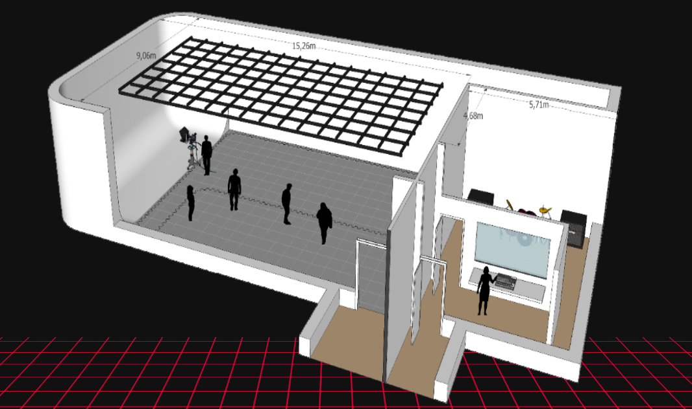
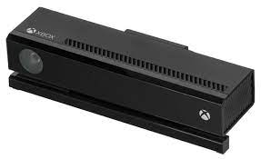
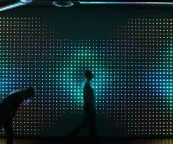
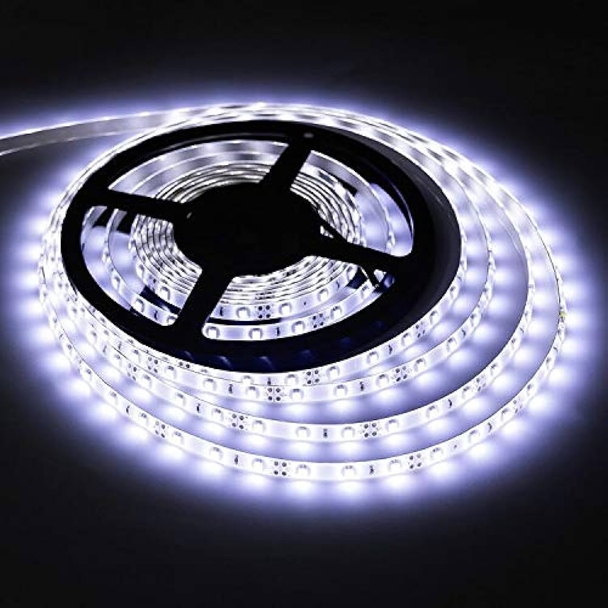

# *Expérience murale mimétique interactif*

## Conceptualisation du projet

>Le concept du mimétisme sera à la base de ce projet et aura pour but de faire vivre une expérience interactive visuelle et auditive aux visiteurs.

>Cette expérience interactive sera en toute sommes simple et complexe à la fois. Ce projet se tiendrait à l'intérieur dans le grand studio et pourrait accueillir de une à plusieurs personnes. Dans le grand studio, l'installation serait constitué d'une structure murale où des leds y seraient installées. Également, il y aurait une kinect pour reconnaître les mouvements humains qui interagirait avec les leds sur la structure murale et aussi il y aurait l'utilisation de hauts-parleurs qui viendraient compléter l'interactivité entre la structure murale de leds.

>Cette expérience avec le concept du mimétisme viendraient jouer sur la vue et l'ouie. La kinect reproduirait les mouvements humains sur le mur de leds.

>Également, il y aurait des sons qui viendraient créer des hallucinations auditive utilisant le concept du mimétisme. Ces sons seraient entendus lorsque deux personnes entreraient en contact par l'intrermédiaire du mur de leds interactives et de la kinect.

>Ces sons pourrraient avoir plusieurs sens, mais l'une des idées potentielles serait de créer des sons rappelant l'espoir, la colère, etc.

>**Source :** [Quartier du digital](https://quartierdudigital.fr/un-mur-interactif-par-google/)

## Emplacement potentiel du projet

>**Source :** [TIM Montmorency](https://tim-montmorency.com/)

## Conception potentielle de l'emplacement du projet

>Comme il est montré dans l'image ci-haut du grand studio, l'idée pour l'installation des divers éléments serait de placer deux structures murales collées pouvant accueillir au moins 2 personnes et duquel la kinect avec l'aide du ou des logiciels copierait les mouvements des participants qu'un projecteur viendrait exposer sur les structures murales.
>Au quatre extrémitées de la zone délimitée du projet, il y aurait des hauts-parleurs qui viendrait englober les participants et ainsi ajouter une expérience sonore intéressante.

## Les logiciels potentiels pour le projet

- Madmaper
- Touch Designer
- Max
- Vcv Rack 2
- Reaper
- Le logiciel de la kinect

## Les principaux matériaux nécessaire au projet

1. Des leds
2. La kinect
3. Un projecteur
4. Une ou des structures murales
5. Des hauts-parleurs
6. Un ordinateur
7. Des fils de courants

>Voici des exemples visuels de certain des objets requis pour la réalisation de ce projet:

>**Source :** [TIM Montmorency](https://tim-montmorency.com/)

## Exemple général de l'application du concept du projet

[Exemple général](https://www.youtube.com/watch?v=rtRscfX8O44)

